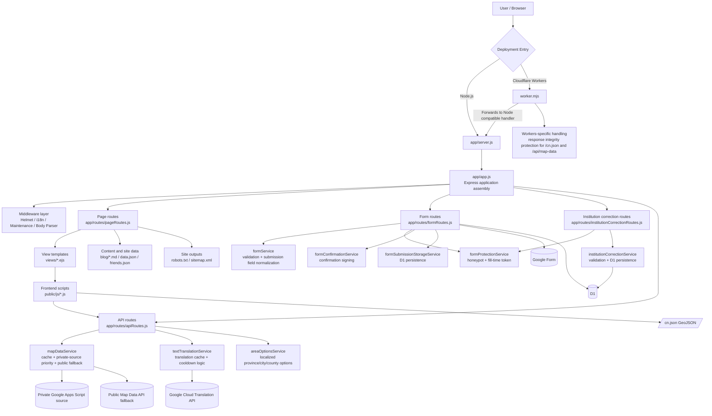

# N·C·T

<div align="center">
  <p><strong>NO CONVERSION THERAPY</strong></p>
  <p>A multilingual site for documenting, organizing, and publicly presenting information about conversion therapy institutions and lived experiences. by: VICTIMS UNION</p>
  <p>
    <a href="./README.md">简体中文</a> ·
    <a href="./README.zh-TW.md">繁體中文</a> ·
    <a href="./README.en.md"><strong>English</strong></a>
  </p>
  <p>
    
    
    
    
    
  </p>
</div>

## Contents

- [Overview](#overview)
- [Live Links](#live-links)
- [Core Capabilities](#core-capabilities)
- [Tech Stack](#tech-stack)
- [Architecture Diagram](#architecture-diagram)
- [Repository Layout](#repository-layout)
- [Quick Start](#quick-start)
- [Common Commands](#common-commands)
- [Playwright Page Smoke Screenshots](#playwright-page-smoke-screenshots)
- [Key Configuration](#key-configuration)
- [Protecting Sensitive Configuration](#protecting-sensitive-configuration)
- [Form Privacy Notice](#form-privacy-notice)
- [Deploying to Cloudflare Workers](#deploying-to-cloudflare-workers)
- [Route Overview](#route-overview)
- [Related Files](#related-files)
- [Public API](#public-api)
- [Contributing](#contributing)
- [License](#license)

## Overview

N·C·T is a site for documenting, organizing, and publicly presenting information about conversion therapy institutions and lived experiences. It includes an anonymous form flow, a public map, blog pages, a multilingual interface, and dual-runtime deployment support for both Node.js and Cloudflare Workers.

- Home page: https://victimsunion.org
- Anonymous form: https://victimsunion.org/form
- Public map: https://victimsunion.org/map

**Historical names and domains**

- NO TORSION
- https://no-torsion.hosinoneko.me
- https://nct.hosinoneko.me

> We commit to not proactively collecting unnecessary personal information for any reason.

## Live Links

| Page | URL |
| --- | --- |
| Home | https://www.victimsunion.org |
| Anonymous Form | https://www.victimsunion.org/form |
| Public Map | https://www.victimsunion.org/map |
| Privacy Notice | https://www.victimsunion.org/privacy |

## Core Capabilities

| Area | Description |
| --- | --- |
| Anonymous submission | Anonymous form flow with anti-abuse protection, rate limiting, and audit logging |
| Institution correction | Provides the `/map/correction` supplement / correction flow and stores submissions in D1 |
| Public map | Public institution map plus `GET /api/map-data` for downstream reuse |
| Blog content | Blog index, article pages, and Markdown rendering |
| Multilingual UI | Simplified Chinese, Traditional Chinese, English, plus selective dynamic translation |
| Site infrastructure | Automatic `robots.txt`, `sitemap.xml`, and asset versioning |
| Dual runtime deployment | Works in local Node.js environments and on Cloudflare Workers |

## Tech Stack

| Category | Choice |
| --- | --- |
| Backend | Node.js 20+, Express 5 |
| Template engine | EJS |
| Frontend | Vanilla JavaScript + Leaflet + Chart.js |
| Runtime targets | Node.js / Cloudflare Workers |
| Submission sink | Google Form / D1 (configurable) |
| Map data source | Private Google Apps Script source with public API fallback |
| Translation provider | Google Cloud Translation API, optional |
| Config security | Built-in `secure-config` encryption helper |

## Architecture Diagram



Notes:

- Node.js and Workers share the same Express business logic. Workers only add entry-layer protection for large JSON responses.
- Page routes, anonymous form routes, institution correction routes, and API routes are separated, while core logic is pushed down into the `service` layer.
- The map page, form cascading selectors, and autocomplete reuse the same `/api/*` endpoints instead of maintaining parallel data flows.

## Repository Layout

```text
.
├── app/
│   ├── middleware/        # i18n, maintenance mode, and other middleware
│   ├── routes/            # page, form, and API routes
│   ├── services/          # form, map, translation, blog, and other core services
│   ├── app.js             # Express application assembly
│   └── server.js          # Node.js server entry
├── config/                # runtime config, i18n, form rules, security
├── public/                # static assets, GeoJSON, frontend scripts, styles
├── views/                 # EJS templates
├── blog/                  # Markdown blog articles
├── migrations/            # D1 database migrations
├── scripts/               # utility scripts such as secure-config
├── tests/                 # automated tests
├── data.json              # blog index and other site data
├── friends.json           # about page links / acknowledgements
├── server.js              # Vercel / Node compatible entry
├── vercel.json            # Vercel deployment config
└── worker.mjs             # Cloudflare Workers entry
```

## Quick Start

### 1. Install dependencies

```bash
git clone https://github.com/NO-CONVERSION-THERAPY/NCT.git
cd NCT
npm install
```

### 2. Choose a local runtime

Node mode:

```bash
npm start
```

Workers mode:

```bash
cp .dev.vars.example .dev.vars
npm run dev:workers
```

Recommendations:

- The repository currently does not include `.env.example`. If you need custom Node environment variables, create `.env` manually by following [`.dev.vars.example`](./.dev.vars.example) and remove the Workers-only `RUNTIME_TARGET`.
- Keep `FORM_DRY_RUN="true"` during local development to avoid accidental writes to live production targets.
- Use `.env` for Node mode and `.dev.vars` for Workers mode. Do not mix them.
- Full inline configuration notes currently live in [`.dev.vars.example`](./.dev.vars.example). For Node mode, write the same variable names into `.env`.

## Common Commands

| Command | Description |
| --- | --- |
| `npm start` | Start the app in Node.js mode |
| `npm run dev:workers` | Run the Workers version locally with Wrangler |
| `npm test` | Run the test suite |
| `npm run playwright:install` | Install the Chromium browser required by Playwright |
| `npm run test:smoke` | Run the Playwright smoke screenshot suite and write artifacts to `test-results/playwright-smoke/` |
| `npm run build` | Run a startup-level build sanity check |
| `npm run secure-config -- bootstrap-env --env-file ".env"` | Read plain-text values from an env file, write encrypted replacements back, and remove the plain-text keys |
| `npm run secure-config -- bootstrap --form-id "..." --google-script-url "..."` | Generate `FORM_PROTECTION_SECRET` and encrypted values in one step |
| `npm run secure-config -- generate-secret` | Generate a strong `FORM_PROTECTION_SECRET` |

## Playwright Page Smoke Screenshots

This suite starts a local app instance and uses Playwright to open critical routes, assert against page-level `console.error`, uncaught exceptions, and failed same-origin requests, then saves a full-page screenshot for each target page.

- Coverage includes the home page, form page, map page, about page, privacy page, blog list, blog article, debug page, standalone submit error page, maintenance page, plus the form preview, confirmation, and success flows.
- Screenshots and a manifest are written to `test-results/playwright-smoke/`. The `manifest.json` file records the route, HTTP status, and screenshot path for each capture.
- The suite injects stable mock data for the map API so screenshots do not drift with live public data changes.
- This suite is intentionally excluded from `npm test` because it depends on browser binaries and host runtime libraries, so it is better run as a dedicated smoke-check step.

First run:

```bash
npm run playwright:install
npm run test:smoke
```

Environment notes:

- If your Linux environment is missing system libraries required to launch Playwright Chromium, the browser may fail to start, for example with a missing `libglib-2.0.so.0` error.
- When that happens, install the required system packages first, or run the suite inside a container or CI image that already includes Playwright runtime dependencies.

## Key Configuration

This README only lists the most important variables. For the full set, see [`.dev.vars.example`](./.dev.vars.example). In Node mode, put the same variable names into `.env`.

| Variable | Purpose |
| --- | --- |
| `SITE_URL` | Canonical site URL for sitemap, robots, and canonical outputs |
| `FORM_DRY_RUN` | When `true`, submissions are previewed but not sent to the configured live target |
| `FORM_SUBMIT_TARGET` | `/form` submission target: `google`, `d1`, or `both`; defaults to `both` |
| `FORM_PROTECTION_SECRET` | Core secret for form protection and encrypted config decryption; when empty, the app derives one automatically |
| `FORM_ID` / `FORM_ID_ENCRYPTED` | Google Form ID, choose one |
| `GOOGLE_SCRIPT_URL` / `GOOGLE_SCRIPT_URL_ENCRYPTED` | Private Apps Script data source, choose one |
| `PUBLIC_MAP_DATA_URL` | Public fallback source when the private source is slow or unavailable |
| `GOOGLE_CLOUD_TRANSLATION_API_KEY` | Required when translation features are enabled |
| `MAINTENANCE_MODE` | Global maintenance switch |
| `MAINTENANCE_NOTICE` | Maintenance page notice text |
| `D1_BINDING_NAME` | Only needed when the D1 binding name is not the default `NCT_DB` / `DB` |
| `RATE_LIMIT_REDIS_URL` | Shared rate-limit storage recommended for multi-instance deployments; defaults to empty |

Configuration rules:

- Choose only one of `FORM_ID` and `FORM_ID_ENCRYPTED`.
- Choose only one of `GOOGLE_SCRIPT_URL` and `GOOGLE_SCRIPT_URL_ENCRYPTED`.
- `FORM_SUBMIT_TARGET` accepts `google`, `d1`, and `both`, with `both` as the default.
- If `FORM_SUBMIT_TARGET` includes `google`, you still need `FORM_ID` or `FORM_ID_ENCRYPTED`.
- If `FORM_SUBMIT_TARGET` includes `d1`, make sure your Worker has a D1 binding; if the binding name is not `NCT_DB` or `DB`, also set `D1_BINDING_NAME`.
- If you use `FORM_ID_ENCRYPTED` or `GOOGLE_SCRIPT_URL_ENCRYPTED`, `FORM_PROTECTION_SECRET` must still be explicitly configured.
- In production Workers deployments, keep sensitive values in Cloudflare Variables and Secrets instead of committing them or placing them in `wrangler.jsonc`.
- If you do not use encrypted config yet, at minimum store `FORM_ID` and `GOOGLE_SCRIPT_URL` as Secrets; `FORM_PROTECTION_SECRET` can be set explicitly or left empty so the app derives one automatically.
- If you do use encrypted config, keep `FORM_PROTECTION_SECRET` as a Secret, while `FORM_ID_ENCRYPTED` and `GOOGLE_SCRIPT_URL_ENCRYPTED` can be Text or Secret.

## Protecting Sensitive Configuration

If you do not want to expose `FORM_ID` or `GOOGLE_SCRIPT_URL` in plain text environment variables, you can switch to encrypted config values.

If those values already exist in `.env` or `.dev.vars`, the easiest path is to read them from the file and convert them in place:

```bash
npm run secure-config -- bootstrap-env --env-file ".env"
```

This updates the target env file directly:

- writes `FORM_PROTECTION_SECRET`
- writes `FORM_ID_ENCRYPTED`
- writes `GOOGLE_SCRIPT_URL_ENCRYPTED`
- removes the corresponding plain-text `FORM_ID` / `GOOGLE_SCRIPT_URL` entries

For local Workers development, you can also read from `.dev.vars`:

```bash
npm run secure-config -- bootstrap-env --env-file ".dev.vars"
```

> Note: if your configured target includes Google Form and your local runtime is in mainland China, live submissions may be affected by network conditions. During development, it is safer to keep `FORM_DRY_RUN="true"` first.

If you prefer a step-by-step flow, generate a secret first and then encrypt each value:

```bash
npm run secure-config -- generate-secret
```

```bash
npm run secure-config -- encrypt --purpose form-id --secret "YOUR_FORM_PROTECTION_SECRET" --value "YOUR_GOOGLE_FORM_ID"
npm run secure-config -- encrypt --purpose google-script-url --secret "YOUR_FORM_PROTECTION_SECRET" --value "YOUR_GOOGLE_SCRIPT_URL"
```

Important boundaries:

- This reduces the risk of plain-text exposure in the repository, logs, generic config panels, or debug pages.
- It does not replace backend trust boundaries. If an attacker can read all server-side secrets, encrypted values and their decryption secret may still be exposed together.
- The most reliable way to prevent bypassing site-side validation is still to avoid exposing the final write path as a publicly writable anonymous Google Form or any other anonymous public write endpoint.

## Form Privacy Notice

The current public notice used on the form page and `/privacy` is:

> Privacy notice: personal basic information such as birth year and sex entered in this questionnaire will be kept strictly confidential. Experience descriptions and exposed institution information may be shown on public pages of this site. Submitted content may be written to Google Form, the D1 database, or both depending on the site configuration. Please do not enter highly sensitive personal data such as ID numbers, private phone numbers, or home addresses in fields that may become public.

If you later change which fields are public, update all of the following together:

- Form page notice `form.privacyNotice`
- Privacy page `/privacy`
- This section in the README

## Deploying to Cloudflare Workers

The recommended production path for this project is GitHub + Workers Builds.

### 1. Validate locally first

```bash
npm install
cp .dev.vars.example .dev.vars
npm run dev:workers
npm test
```

### 2. Connect the GitHub repository

In the Cloudflare Dashboard:

1. Go to `Workers & Pages`
2. Click `Create application`
3. Choose `Import a repository`
4. Authorize the GitHub App and select this repository

### 3. Recommended build settings

| Item | Recommended value |
| --- | --- |
| `Root directory` | `.` |
| `Build command` | Leave empty |
| `Deploy command` | `npm run deploy:workers` |

Additional notes:

- You can adjust the production branch in `Settings -> Build -> Branch control`.
- The repository copy of [`wrangler.jsonc`](./wrangler.jsonc) keeps `RUNTIME_TARGET="workers"` plus a minimal `NCT_DB` D1 binding, so GitHub / PR-based deployments can auto-provision D1 without committing an account-specific `database_id`.
- Put the rest of your runtime Variables / Secrets in the Cloudflare Dashboard or local `.dev.vars`.

### 4. Add Variables and Secrets

Deployment recommendations:

- The simplest correct setup is to store `FORM_ID` and `GOOGLE_SCRIPT_URL` as Secrets; `FORM_PROTECTION_SECRET` can be stored as a Secret explicitly or left empty so the app derives one automatically.
- If you want to further reduce the risk of accidental plain-text exposure, switch to `FORM_ID_ENCRYPTED` and `GOOGLE_SCRIPT_URL_ENCRYPTED`, while keeping `FORM_PROTECTION_SECRET` as a Secret.

| Name | Type | Description |
| --- | --- | --- |
| `SITE_URL` | Text | Production site URL |
| `FORM_DRY_RUN` | Text | Usually `false` in production |
| `FORM_SUBMIT_TARGET` | Text | `/form` submission target: `google`, `d1`, or `both`; defaults to `both` |
| `FORM_PROTECTION_SECRET` | Secret | Used for form protection and encrypted config decryption; when empty, the app derives one automatically |
| `FORM_ID` | Secret | Plain Google Form ID for the simple setup |
| `FORM_ID_ENCRYPTED` | Text or Secret | Encrypted Google Form ID, leave `FORM_ID` empty when using this |
| `GOOGLE_SCRIPT_URL` | Secret | Plain private data source URL for the simple setup |
| `GOOGLE_SCRIPT_URL_ENCRYPTED` | Text or Secret | Encrypted private data source URL, leave `GOOGLE_SCRIPT_URL` empty when using this |
| `PUBLIC_MAP_DATA_URL` | Text | Public fallback API when no private source is available |
| `GOOGLE_CLOUD_TRANSLATION_API_KEY` | Secret | Only needed when translation is enabled |
| `MAINTENANCE_MODE` | Text | Set to `true` when you need full-site maintenance mode |
| `MAINTENANCE_NOTICE` | Text | Maintenance announcement text |
| `D1_BINDING_NAME` | Text | Only set this when the D1 binding name is not `NCT_DB` / `DB` |
| `RATE_LIMIT_REDIS_URL` | Secret | Recommended for multi-instance deployments; defaults to empty |

### 5. Deploy D1

Default deployment flow:

1. Keep the repository copy of [`wrangler.jsonc`](./wrangler.jsonc) unchanged. It already contains the minimal D1 binding:

```jsonc
"d1_databases": [
  {
    "binding": "NCT_DB",
    "migrations_dir": "migrations"
  }
]
```

2. Import the repository into Cloudflare `Workers & Pages`
3. Add the runtime Variables / Secrets in `Settings -> Variables and Secrets`
4. Deploy the project
5. After the first deploy, open `Settings -> Bindings` and confirm that the `NCT_DB` binding is present

If you want to use an existing D1 database in your own account:

1. Open `Settings -> Bindings`
2. Click `Add binding`
3. Choose `D1 database`
4. Set `Variable name` to `NCT_DB`
5. Select the existing D1 database
6. Save and redeploy once

If you need to pin a specific existing D1 database in config, use the full form below:

```jsonc
"d1_databases": [
  {
    "binding": "NCT_DB",
    "database_name": "<your-d1-database-name>",
    "database_id": "<your-d1-database-id>",
    "migrations_dir": "migrations"
  }
]
```

Notes:

- If the binding name is not `NCT_DB` or `DB`, also set `D1_BINDING_NAME`
- If you use separate Preview / Production environments, verify the D1 binding in both places
- A `D1` binding is not part of Variables / Secrets, so environment variables alone are not enough

### 6. D1 Tables and Common Queries

This project mainly writes to these two D1 tables:

| Route / feature | D1 table name | Description |
| --- | --- | --- |
| `/form` | `form_submissions` | Records written by the main anonymous form submission flow |
| `/map/correction` | `institution_correction_submissions` | Records written by the institution information supplement / correction form |

First, list the D1 databases available in your account:

```bash
npx wrangler d1 list
```

To query the remote production database, replace `<your-database-name>` in the command below and keep `--remote`:

```bash
npx wrangler d1 execute <your-database-name> --remote --command="SELECT name FROM sqlite_master WHERE type='table' ORDER BY name;"
```

Common query examples:

```bash
# Latest 20 /form submissions
npx wrangler d1 execute <your-database-name> --remote --command="SELECT id, school_name, contact_information, created_at FROM form_submissions ORDER BY created_at DESC LIMIT 20;"

# Latest 20 /map/correction submissions
npx wrangler d1 execute <your-database-name> --remote --command="SELECT id, school_name, correction_content, status, created_at FROM institution_correction_submissions ORDER BY created_at DESC LIMIT 20;"

# Search /form by institution name
npx wrangler d1 execute <your-database-name> --remote --command="SELECT id, school_name, province_name, city_name, created_at FROM form_submissions WHERE school_name LIKE '%institution name%' ORDER BY created_at DESC;"

# Search /map/correction by institution name
npx wrangler d1 execute <your-database-name> --remote --command="SELECT id, school_name, correction_content, status, created_at FROM institution_correction_submissions WHERE school_name LIKE '%institution name%' ORDER BY created_at DESC;"
```

If you only need the SQL itself, use:

```sql
SELECT name
FROM sqlite_master
WHERE type = 'table'
ORDER BY name;

SELECT id, school_name, contact_information, created_at
FROM form_submissions
ORDER BY created_at DESC
LIMIT 20;

SELECT id, school_name, correction_content, status, created_at
FROM institution_correction_submissions
ORDER BY created_at DESC
LIMIT 20;

SELECT *
FROM form_submissions
WHERE school_name LIKE '%institution name%'
ORDER BY created_at DESC;

SELECT *
FROM institution_correction_submissions
WHERE school_name LIKE '%institution name%'
ORDER BY created_at DESC;
```

Notes:

- To inspect table columns, run `PRAGMA table_info(form_submissions);` or `PRAGMA table_info(institution_correction_submissions);`
- `--remote` queries the real Cloudflare database, while `--local` queries the local Wrangler development database

### 7. Bind the production domain

If you do not want to use `*.workers.dev`, add a custom domain in `Settings -> Domains & Routes`. After binding the domain, remember to update:

- `SITE_URL`
- `PUBLIC_MAP_DATA_URL`

### 8. Post-launch checklist

After production deployment, it is a good idea to manually verify at least these paths:

- `/`
- `/map`
- `/form`
- `/map/correction`
- `/blog`
- `/api/map-data`
- `/api/area-options?provinceCode=110000`
- `/cn.json`
- `/sitemap.xml`
- `/robots.txt`

If `FORM_DRY_RUN="false"`, also perform a real submission test to confirm that data reaches the currently configured target backend(s) successfully.
If translation is enabled, also test `POST /api/translate-text`.

### 9. Known differences on Workers

- Templates, blog Markdown, and JSON files are read from the Workers `/bundle`.
- The translation service no longer uses a `curl` subprocess fallback and now always uses Google Cloud Translation API directly.
- On Workers, `sitemap.xml` prefers each article's `CreationDate` metadata as `lastmod`.
- If shared Redis is not configured, rate limiting falls back to single-instance memory mode, so cross-instance consistency is weaker.

### 10. FAQ

**Q: Will local `npm start` conflict with the Workers version?**<br>
A: No. They are simply two different local entry points.

**Q: Does this project need an extra frontend build step?**<br>
A: Not currently. In most cases the Workers Builds `Build command` can stay empty.

**Q: Why is the `Deploy command` `npm run deploy:workers`?**<br>
A: Because it calls `npx wrangler deploy` and stays aligned with this repository's `package.json`.

## Route Overview

By default, every page route passes through the i18n middleware, so the UI language can be switched with `?lang=zh-CN`, `?lang=zh-TW`, or `?lang=en`. If maintenance mode is enabled, both pages and APIs are intercepted by the maintenance layer first.

### Page Routes

| Path | Description | Notes |
| --- | --- | --- |
| `/robots.txt` | Generated robots policy | Produced by `robotsService` |
| `/sitemap.xml` | Generated sitemap | Reads `blog/` and `data.json` |
| `/` | Home page with links to the form, map, and library | Renders `views/index.ejs` |
| `/form` | Anonymous form page that injects area options, frontend validation rules, and anti-abuse tokens | Sends sensitive-page headers and is excluded from indexing |
| `/map/correction` | Institution information supplement / correction page | Submits to `POST /map/correction/submit`; the write step requires a working D1 binding |
| `/map` | Map overview page showing institution distribution, statistics, and the public data list | Supports `?inputType=` preset filtering |
| `/map/record/:recordSlug` | Map submission detail page that renders a standalone submission view and supports previous / next navigation within the same institution | Entered from the `/map` "View detail page" action and renders `views/map_record.ejs` |
| `/aboutus` | About page with project information and acknowledgements / friend links | Reads `friends.json` |
| `/privacy` | Privacy and Cookie Notice page | Explains public-facing data handling boundaries |
| `/blog` | Library index page with blog entries and tag filtering | Supports `?tag=<tagId>` |
| `/port/:id` | Single article detail page | `:id` is strictly resolved inside the `blog/` directory to prevent path traversal |
| `/debug` | Debug page showing the current language, API URL, debug mode, and related runtime details | Only available when `DEBUG_MOD=true` |
| `/debug/submit-error` | Standalone preview of the submission error page with a prefilled Google Form fallback link | Only available when `DEBUG_MOD=true` |

### Submission Routes

| Path | Description | Notes |
| --- | --- | --- |
| `POST /submit` | Entry point for anonymous form submissions | Returns a preview page when `FORM_DRY_RUN=true`, otherwise moves to the confirmation step |
| `POST /submit/confirm` | Final submission step after confirmation | Writes to Google Form, D1, or both depending on `FORM_SUBMIT_TARGET` |
| `POST /map/correction/submit` | Entry point for institution supplement / correction submissions | Writes to D1 only; returns 503 if no usable binding is available |

### API and Static Data Routes

| Path | Description | Notes |
| --- | --- | --- |
| `/api/area-options` | Returns province / city / county cascading options | Pass `provinceCode` for cities or `cityCode` for counties |
| `/api/map-data` | Returns aggregated map payload | Supports `?refresh=1` for a forced refresh and has stricter refresh rate limiting |
| `POST /api/translate-text` | On-demand translation for a small set of map detail fields | Requires `GOOGLE_CLOUD_TRANSLATION_API_KEY` |
| `/cn.json` | Returns the China GeoJSON used by the map | Both Node and Workers add large-file integrity protection |

## Related Files

- [`.dev.vars.example`](./.dev.vars.example): local environment variable template; for Node mode, create `.env` with the same variable names
- [`migrations/`](./migrations): D1 schema migrations
- [`server.js`](./server.js): Vercel / Node compatible entry
- [`vercel.json`](./vercel.json): Vercel deployment config
- [`wrangler.jsonc`](./wrangler.jsonc): Workers configuration
- [`scripts/secure-config.js`](./scripts/secure-config.js): encryption helper for sensitive config
- [`worker.mjs`](./worker.mjs): Cloudflare Workers entry

If you change public fields, the submission flow, or upstream data sources, review this README together with [`/privacy`](https://www.victimsunion.org/privacy) and the form notice text so that public-facing documentation stays aligned with actual behavior.

---

## Public API

### `GET /api/map-data`

Public endpoint:

```text
https://nct.hosinoeiji.workers.dev/api/map-data
```

If you deploy it yourself, use your own domain instead, for example:

```text
https://your-domain.example/api/map-data
```

Example response:

```json
{
  "avg_age": 17,
  "last_synced": 1774925078387,
  "statistics": [
    { "province": "Henan", "count": 12 },
    { "province": "Hubei", "count": 66 }
  ],
  "data": [
    {
      "name": "School name",
      "addr": "School address",
      "province": "Province",
      "prov": "District / County",
      "else": "Additional notes",
      "lat": 36.62728,
      "lng": 118.58882,
      "experience": "Experience description",
      "HMaster": "Principal / Head name",
      "scandal": "Known scandals",
      "contact": "School contact information",
      "inputType": "Victim"
    }
  ]
}
```

Field notes:

- `lat` / `lng`: latitude and longitude
- `last_synced`: Unix timestamp in milliseconds
- The actual institution list is inside the `data` field

### Simplest usage example

```html
<script>
  fetch('https://nct.hosinoeiji.workers.dev/api/map-data')
    .then((res) => res.json())
    .then((payload) => {
      console.log(payload.data);
    });
</script>
```

If you want to turn the data into a map, you can use it directly with frontend mapping libraries such as [Leaflet](https://leafletjs.com). This project's own `/map` page is a complete example.

### Other Frontend-Facing Endpoints

| Endpoint | Purpose | Method / Parameters |
| --- | --- | --- |
| `/api/area-options` | Cascading province/city/county options for the form and institution correction page | `GET`; pass `provinceCode` or `cityCode` |
| `/api/translate-text` | Small-batch translation for map detail fields | `POST` JSON; send `items` and `targetLanguage`, and configure a translation provider on the server |
| `/cn.json` | China GeoJSON consumed by the map | `GET` |

---

## Contributing

Issues, pull requests, and self-hosted forks are all welcome.

Before submitting changes, it is recommended to at least confirm:

```bash
npm test
```

If your changes affect deployment, environment variables, or the form flow, it is also a good idea to verify:

- `/form`
- `/submit`
- `/api/map-data`
- `/blog`

---

## License

See [LICENSE](./LICENSE) for this project's license information.
