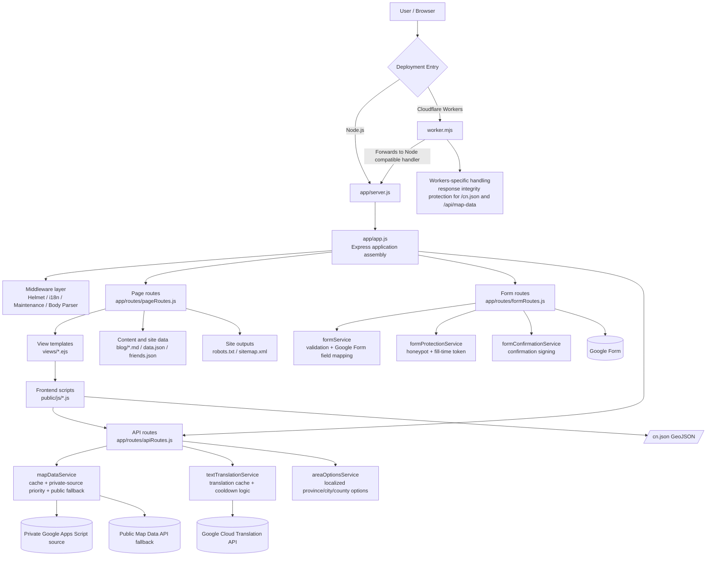

# N·C·T

<div align="center">
  <p><strong>NO CONVERSION THERAPY</strong></p>
  <p>A multilingual site for documenting, organizing, and publicly presenting information about conversion therapy institutions and lived experiences. by: VICTIMS UNION</p>
  <p>
    <a href="./README.md">简体中文</a> ·
    <a href="./README.zh-TW.md">繁體中文</a> ·
    <a href="./README.en.md"><strong>English</strong></a>
  </p>
  <p>
    
    
    
    
    
  </p>
</div>

## Contents

- [Overview](#overview)
- [Live Links](#live-links)
- [Core Capabilities](#core-capabilities)
- [Tech Stack](#tech-stack)
- [Architecture Diagram](#architecture-diagram)
- [Repository Layout](#repository-layout)
- [Quick Start](#quick-start)
- [Common Commands](#common-commands)
- [Key Configuration](#key-configuration)
- [Protecting Sensitive Configuration](#protecting-sensitive-configuration)
- [Form Privacy Notice](#form-privacy-notice)
- [Deploying to Cloudflare Workers](#deploying-to-cloudflare-workers)
- [Related Files](#related-files)
- [Public API](#public-api)
- [Contributing](#contributing)
- [License](#license)

## Overview

N·C·T is a site for documenting, organizing, and publicly presenting information about conversion therapy institutions and lived experiences. It includes an anonymous form flow, a public map, blog pages, a multilingual interface, and dual-runtime deployment support for both Node.js and Cloudflare Workers.

- Home page: https://victimsunion.org
- Anonymous form: https://victimsunion.org/form
- Public map: https://victimsunion.org/map
- Original Google Form: https://forms.gle/eHwkmNCZtmZhLjzh7

**Historical names and domains**

- NO TORSION
- https://no-torsion.hosinoneko.me
- https://nct.hosinoneko.me

> We commit to not proactively collecting unnecessary personal information for any reason.

## Live Links

| Page | URL |
| --- | --- |
| Home | https://www.victimsunion.org |
| Anonymous Form | https://www.victimsunion.org/form |
| Public Map | https://www.victimsunion.org/map |
| Privacy Notice | https://www.victimsunion.org/privacy |

## Core Capabilities

| Area | Description |
| --- | --- |
| Anonymous submission | Anonymous form flow with anti-abuse protection, rate limiting, and audit logging |
| Public map | Public institution map plus `GET /api/map-data` for downstream reuse |
| Blog content | Blog index, article pages, and Markdown rendering |
| Multilingual UI | Simplified Chinese, Traditional Chinese, English, plus selective dynamic translation |
| Site infrastructure | Automatic `robots.txt`, `sitemap.xml`, and asset versioning |
| Dual runtime deployment | Works in local Node.js environments and on Cloudflare Workers |

## Tech Stack

| Category | Choice |
| --- | --- |
| Backend | Node.js 20+, Express 5 |
| Template engine | EJS |
| Frontend | Vanilla JavaScript + Leaflet + Chart.js |
| Runtime targets | Node.js / Cloudflare Workers |
| Submission sink | Google Form |
| Map data source | Private Google Apps Script source with public API fallback |
| Translation provider | Google Cloud Translation API, optional |
| Config security | Built-in `secure-config` encryption helper |

## Architecture Diagram



Notes:

- Node.js and Workers share the same Express business logic. Workers only add entry-layer protection for large JSON responses.
- Page routes, form routes, and API routes are separated, while core logic is pushed down into the `service` layer.
- The map page, form cascading selectors, and autocomplete reuse the same `/api/*` endpoints instead of maintaining parallel data flows.

## Repository Layout

```text
.
├── app/
│   ├── middleware/        # i18n, maintenance mode, and other middleware
│   ├── routes/            # page, form, and API routes
│   ├── services/          # form, map, translation, blog, and other core services
│   ├── app.js             # Express application assembly
│   └── server.js          # Node.js server entry
├── config/                # runtime config, i18n, form rules, security
├── public/                # static assets, GeoJSON, frontend scripts, styles
├── views/                 # EJS templates
├── blog/                  # Markdown blog articles
├── scripts/               # utility scripts such as secure-config
├── tests/                 # automated tests
└── worker.mjs             # Cloudflare Workers entry
```

## Quick Start

### 1. Install dependencies

```bash
git clone https://github.com/NO-CONVERSION-THERAPY/NCT.git
cd NCT
npm install
```

### 2. Choose a local runtime

Node mode:

```bash
cp .env.example .env
npm start
```

Workers mode:

```bash
cp .dev.vars.example .dev.vars
npm run dev:workers
```

Recommendations:

- Keep `FORM_DRY_RUN="true"` during local development to avoid accidental writes to a production Google Form.
- Use `.env` for Node mode and `.dev.vars` for Workers mode. Do not mix them.
- For full inline configuration notes, read [`.env.example`](./.env.example) and [`.dev.vars.example`](./.dev.vars.example).

## Common Commands

| Command | Description |
| --- | --- |
| `npm start` | Start the app in Node.js mode |
| `npm run dev:workers` | Run the Workers version locally with Wrangler |
| `npm test` | Run the test suite |
| `npm run build` | Run a startup-level build sanity check |
| `npm run secure-config -- bootstrap-env --env-file ".env"` | Read `FORM_ID` / `GOOGLE_SCRIPT_URL` from an env file and generate encrypted values |
| `npm run secure-config -- bootstrap --form-id "..." --google-script-url "..."` | Generate `FORM_PROTECTION_SECRET` and encrypted values in one step |
| `npm run secure-config -- generate-secret` | Generate a strong `FORM_PROTECTION_SECRET` |

## Key Configuration

This README only lists the most important variables. For the full set, see [`.env.example`](./.env.example).

| Variable | Purpose |
| --- | --- |
| `SITE_URL` | Canonical site URL for sitemap, robots, and canonical outputs |
| `FORM_DRY_RUN` | When `true`, submissions are previewed but not sent to Google Form |
| `FORM_PROTECTION_SECRET` | Core secret for form protection and encrypted config decryption |
| `FORM_ID` / `FORM_ID_ENCRYPTED` | Google Form ID, choose one |
| `GOOGLE_SCRIPT_URL` / `GOOGLE_SCRIPT_URL_ENCRYPTED` | Private Apps Script data source, choose one |
| `PUBLIC_MAP_DATA_URL` | Public fallback source when the private source is slow or unavailable |
| `GOOGLE_CLOUD_TRANSLATION_API_KEY` | Required when translation features are enabled |
| `MAINTENANCE_MODE` | Global maintenance switch |
| `MAINTENANCE_NOTICE` | Maintenance page notice text |
| `RATE_LIMIT_REDIS_URL` | Shared rate-limit storage recommended for multi-instance deployments |

Configuration rules:

- Choose only one of `FORM_ID` and `FORM_ID_ENCRYPTED`.
- Choose only one of `GOOGLE_SCRIPT_URL` and `GOOGLE_SCRIPT_URL_ENCRYPTED`.
- If you use encrypted values, `FORM_PROTECTION_SECRET` must be explicitly configured.
- In production Workers deployments, keep sensitive values in Cloudflare Variables and Secrets instead of committing them or placing them in `wrangler.jsonc`.
- If you do not use encrypted config yet, at minimum store `FORM_ID`, `GOOGLE_SCRIPT_URL`, and `FORM_PROTECTION_SECRET` as Secrets.
- If you do use encrypted config, keep `FORM_PROTECTION_SECRET` as a Secret, while `FORM_ID_ENCRYPTED` and `GOOGLE_SCRIPT_URL_ENCRYPTED` can be Text or Secret.

## Protecting Sensitive Configuration

If you do not want to expose `FORM_ID` or `GOOGLE_SCRIPT_URL` in plain text environment variables, you can switch to encrypted config values.

If those values already exist in `.env` or `.dev.vars`, the easiest path is to read them from the file and generate encrypted replacements:

```bash
npm run secure-config -- bootstrap-env --env-file ".env"
```

This prints:

- `FORM_PROTECTION_SECRET`
- `FORM_ID_ENCRYPTED`
- `GOOGLE_SCRIPT_URL_ENCRYPTED`

For local Workers development, you can also read from `.dev.vars`:

```bash
npm run secure-config -- bootstrap-env --env-file ".dev.vars"
```

> Note: if your local runtime is in mainland China, real submissions to Google Form may be affected by network conditions. During development, it is safer to keep `FORM_DRY_RUN="true"` first.

If you prefer a step-by-step flow, generate a secret first and then encrypt each value:

```bash
npm run secure-config -- generate-secret
```

```bash
npm run secure-config -- encrypt --purpose form-id --secret "YOUR_FORM_PROTECTION_SECRET" --value "YOUR_GOOGLE_FORM_ID"
npm run secure-config -- encrypt --purpose google-script-url --secret "YOUR_FORM_PROTECTION_SECRET" --value "YOUR_GOOGLE_SCRIPT_URL"
```

Important boundaries:

- This reduces the risk of plain-text exposure in the repository, logs, generic config panels, or debug pages.
- It does not replace backend trust boundaries. If an attacker can read all server-side secrets, encrypted values and their decryption secret may still be exposed together.
- The most reliable way to prevent bypassing site-side validation is still to avoid exposing a final write endpoint as a publicly writable anonymous Google Form.

## Form Privacy Notice

The current public notice used on the form page and `/privacy` is:

> Privacy notice: personal basic information such as birth year and sex entered in this questionnaire will be kept strictly confidential. Experience descriptions and exposed institution information may be shown on public pages of this site. Submitted content is stored and organized through Google Form / Google Sheets. Please do not enter highly sensitive personal data such as ID numbers, private phone numbers, or home addresses in fields that may become public.

If you later change which fields are public, update all of the following together:

- Form page notice `form.privacyNotice`
- Privacy page `/privacy`
- This section in the README

## Deploying to Cloudflare Workers

The recommended production path for this project is GitHub + Workers Builds.

### 1. Validate locally first

```bash
npm install
cp .dev.vars.example .dev.vars
npm run dev:workers
npm test
```

### 2. Connect the GitHub repository

In the Cloudflare Dashboard:

1. Go to `Workers & Pages`
2. Click `Create application`
3. Choose `Import a repository`
4. Authorize the GitHub App and select this repository

### 3. Recommended build settings

| Item | Recommended value |
| --- | --- |
| `Root directory` | `.` |
| `Build command` | Leave empty |
| `Deploy command` | `npm run deploy:workers` |

Additional notes:

- You can adjust the production branch in `Settings -> Build -> Branch control`.
- The repository copy of [`wrangler.jsonc`](./wrangler.jsonc) keeps only the required `RUNTIME_TARGET="workers"`. Put the rest of your variables in the Cloudflare Dashboard or local `.dev.vars`.

### 4. Add Variables and Secrets

Deployment recommendations:

- The simplest correct setup is to store `FORM_ID`, `GOOGLE_SCRIPT_URL`, and `FORM_PROTECTION_SECRET` as Secrets.
- If you want to further reduce the risk of accidental plain-text exposure, switch to `FORM_ID_ENCRYPTED` and `GOOGLE_SCRIPT_URL_ENCRYPTED`, while keeping `FORM_PROTECTION_SECRET` as a Secret.

| Name | Type | Description |
| --- | --- | --- |
| `SITE_URL` | Text | Production site URL |
| `FORM_DRY_RUN` | Text | Usually `false` in production |
| `FORM_PROTECTION_SECRET` | Secret | Required for form protection and encrypted config decryption |
| `FORM_ID` | Secret | Plain Google Form ID for the simple setup |
| `FORM_ID_ENCRYPTED` | Text or Secret | Encrypted Google Form ID, leave `FORM_ID` empty when using this |
| `GOOGLE_SCRIPT_URL` | Secret | Plain private data source URL for the simple setup |
| `GOOGLE_SCRIPT_URL_ENCRYPTED` | Text or Secret | Encrypted private data source URL, leave `GOOGLE_SCRIPT_URL` empty when using this |
| `PUBLIC_MAP_DATA_URL` | Text | Public fallback API when no private source is available |
| `GOOGLE_CLOUD_TRANSLATION_API_KEY` | Secret | Only needed when translation is enabled |
| `MAINTENANCE_MODE` | Text | Set to `true` when you need full-site maintenance mode |
| `MAINTENANCE_NOTICE` | Text | Maintenance announcement text |
| `RATE_LIMIT_REDIS_URL` | Secret | Recommended for multi-instance deployments |

### 5. Bind the production domain

If you do not want to use `*.workers.dev`, add a custom domain in `Settings -> Domains & Routes`. After binding the domain, remember to update:

- `SITE_URL`
- `PUBLIC_MAP_DATA_URL`

### 6. Post-launch checklist

After production deployment, it is a good idea to manually verify at least these paths:

- `/`
- `/map`
- `/form`
- `/blog`
- `/api/map-data`
- `/sitemap.xml`
- `/robots.txt`

If `FORM_DRY_RUN="false"`, also perform a real form submission test to confirm that data reaches Google Form successfully.

### 7. Known differences on Workers

- Templates, blog Markdown, and JSON files are read from the Workers `/bundle`.
- The translation service no longer uses a `curl` subprocess fallback and now always uses Google Cloud Translation API directly.
- On Workers, `sitemap.xml` prefers each article's `CreationDate` metadata as `lastmod`.
- If shared Redis is not configured, rate limiting falls back to single-instance memory mode, so cross-instance consistency is weaker.

### 8. FAQ

**Q: Will local `npm start` conflict with the Workers version?**<br>
A: No. They are simply two different local entry points.

**Q: Does this project need an extra frontend build step?**<br>
A: Not currently. In most cases the Workers Builds `Build command` can stay empty.

**Q: Why is the `Deploy command` `npm run deploy:workers`?**<br>
A: Because it calls `npx wrangler deploy` and stays aligned with this repository's `package.json`.

## Related Files

- [`.env.example`](./.env.example): example environment variables for Node mode
- [`.dev.vars.example`](./.dev.vars.example): example local Workers variables
- [`wrangler.jsonc`](./wrangler.jsonc): Workers configuration
- [`scripts/secure-config.js`](./scripts/secure-config.js): encryption helper for sensitive config
- [`worker.mjs`](./worker.mjs): Cloudflare Workers entry

If you change public fields, the submission flow, or upstream data sources, review this README together with [`/privacy`](https://www.victimsunion.org/privacy) and the form notice text so that public-facing documentation stays aligned with actual behavior.

---

## Public API

### `GET /api/map-data`

Public endpoint:

```text
https://nct.hosinoeiji.workers.dev/api/map-data
```

If you deploy it yourself, use your own domain instead, for example:

```text
https://your-domain.example/api/map-data
```

Example response:

```json
{
  "avg_age": 17,
  "last_synced": 1774925078387,
  "statistics": [
    { "province": "Henan", "count": 12 },
    { "province": "Hubei", "count": 66 }
  ],
  "data": [
    {
      "name": "School name",
      "addr": "School address",
      "province": "Province",
      "prov": "District / County",
      "else": "Additional notes",
      "lat": 36.62728,
      "lng": 118.58882,
      "experience": "Experience description",
      "HMaster": "Principal / Head name",
      "scandal": "Known scandals",
      "contact": "School contact information",
      "inputType": "Victim"
    }
  ]
}
```

Field notes:

- `lat` / `lng`: latitude and longitude
- `last_synced`: Unix timestamp in milliseconds
- The actual institution list is inside the `data` field

### Simplest usage example

```html
<script>
  fetch('https://nct.hosinoeiji.workers.dev/api/map-data')
    .then((res) => res.json())
    .then((payload) => {
      console.log(payload.data);
    });
</script>
```

If you want to turn the data into a map, you can use it directly with frontend mapping libraries such as [Leaflet](https://leafletjs.com). This project's own `/map` page is a complete example.

---

## Contributing

Issues, pull requests, and self-hosted forks are all welcome.

Before submitting changes, it is recommended to at least confirm:

```bash
npm test
```

If your changes affect deployment, environment variables, or the form flow, it is also a good idea to verify:

- `/form`
- `/submit`
- `/api/map-data`
- `/blog`

---

## License

See [LICENSE](./LICENSE) for this project's license information.
