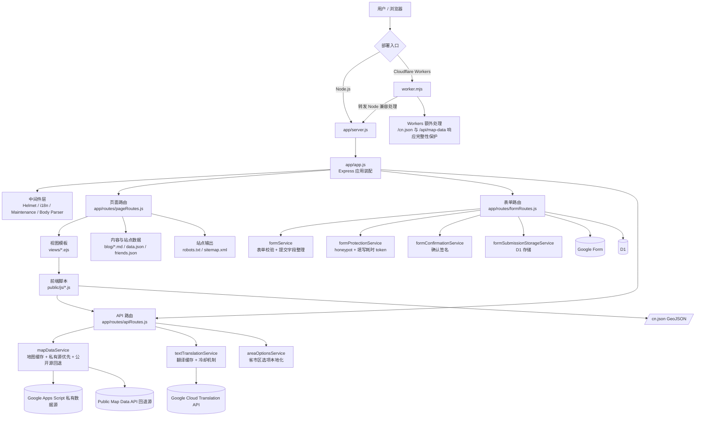

# N·C·T

<div align="center">
  <p><strong>NO CONVERSION THERAPY</strong></p>
  <p>用于记录、整理与公开展示“扭转治疗”相关机构与经历信息的多语言站点。by: VICTIMS UNION</p>
  <p>
    <a href="./README.md"><strong>简体中文</strong></a> ·
    <a href="./README.zh-TW.md">繁體中文</a> ·
    <a href="./README.en.md">English</a>
  </p>
  <p>
    
    
    
    
    
  </p>
</div>

## 目录

- [项目简介](#项目简介)
- [线上入口](#线上入口)
- [核心能力](#核心能力)
- [技术栈](#技术栈)
- [技术架构图](#技术架构图)
- [仓库结构](#仓库结构)
- [快速开始](#快速开始)
- [常用命令](#常用命令)
- [Playwright 页面冒烟截图巡检](#playwright-页面冒烟截图巡检)
- [关键配置](#关键配置)
- [保护敏感配置](#保护敏感配置)
- [表单隐私说明](#表单隐私说明)
- [部署到 Cloudflare Workers](#部署到-cloudflare-workers)
- [路由总览](#路由总览)
- [相关文件](#相关文件)
- [公开 API](#公开-api)
- [贡献](#贡献)
- [授权](#授权)

## 项目简介

N·C·T 是一个用来记录、整理、公开展示“扭转治疗”相关机构与经历信息的站点。它提供匿名表单、公开地图、博客文章、多语言界面，以及 Node.js 与 Cloudflare Workers 双运行时部署能力，方便在不同环境下持续运行。

- 站点首页：https://victimsunion.org
- 匿名表单：https://victimsunion.org/form
- 公开地图：https://victimsunion.org/map

**历史曾用名和域名**

- NO TORSION
- https://no-torsion.hosinoneko.me
- https://nct.hosinoneko.me

> 我们承诺不以任何理由主动收集不必要的个人信息。

## 线上入口

| 页面 | 链接 |
| --- | --- |
| 站点首页 | https://www.victimsunion.org |
| 匿名表单 | https://www.victimsunion.org/form |
| 公开地图 | https://www.victimsunion.org/map |
| 隐私说明 | https://www.victimsunion.org/privacy |

## 核心能力

| 模块 | 说明 |
| --- | --- |
| 匿名表单 | 支持匿名提交，带基础防刷、限流与审计日志 |
| 公开地图 | 对外展示机构数据，并提供 `GET /api/map-data` 接口 |
| 博客内容 | 支持博客列表、文章详情与 Markdown 渲染 |
| 多语言界面 | 支持简体中文、繁体中文、英文，以及部分动态翻译 |
| 站点基础设施 | 自动输出 `robots.txt`、`sitemap.xml`、静态资源版本号 |
| 双运行时部署 | 支持本地 Node.js 运行，也支持 Cloudflare Workers 部署 |

## 技术栈

| 类别 | 选型 |
| --- | --- |
| 服务端 | Node.js 20+, Express 5 |
| 模板引擎 | EJS |
| 前端 | 原生 JavaScript + Leaflet + Chart.js |
| 部署运行时 | Node.js / Cloudflare Workers |
| 数据写入 | Google Form / D1（按配置启用） |
| 地图数据源 | Google Apps Script 私有源，可回退到公开 API |
| 翻译能力 | Google Cloud Translation API，可选启用 |
| 配置安全 | 自带 `secure-config` 密文生成工具 |

## 技术架构图



补充说明：

- Node.js 与 Workers 共用同一套 Express 业务逻辑，Workers 只在入口层额外保护大 JSON 响应。
- 页面、表单、API 三类路由分开管理，主要业务逻辑沉到 `service` 层。
- 地图页、表单联动和自动补全共用 `/api/*` 能力，避免维护多套数据入口。

## 仓库结构

```text
.
├── app/
│   ├── middleware/        # i18n、维护模式等中间件
│   ├── routes/            # 页面、表单、API 路由
│   ├── services/          # 表单、地图、翻译、博客等核心服务
│   ├── app.js             # Express 应用装配
│   └── server.js          # Node.js 启动入口
├── config/                # 运行时配置、i18n、表单规则、安全配置
├── public/                # 静态资源、GeoJSON、前端脚本与样式
├── views/                 # EJS 模板
├── blog/                  # Markdown 博客文章
├── scripts/               # 运维脚本，例如 secure-config
├── tests/                 # 自动化测试
└── worker.mjs             # Cloudflare Workers 入口
```

## 快速开始

### 1. 安装依赖

```bash
git clone https://github.com/NO-CONVERSION-THERAPY/NCT.git
cd NCT
npm install
```

### 2. 选择本地运行方式

Node 模式：

```bash
cp .env.example .env
npm start
```

Workers 模式：

```bash
cp .dev.vars.example .dev.vars
npm run dev:workers
```

建议：

- 本地开发先保持 `FORM_DRY_RUN="true"`，避免误提交到正式环境的实际接收端。
- Node 模式使用 `.env`，Workers 模式使用 `.dev.vars`，不要混用。
- 完整配置注释请直接查看 [`.env.example`](./.env.example) 与 [`.dev.vars.example`](./.dev.vars.example)。

## 常用命令

| 命令 | 说明 |
| --- | --- |
| `npm start` | 以 Node.js 启动应用 |
| `npm run dev:workers` | 使用 Wrangler 本地调试 Workers 版本 |
| `npm test` | 运行测试 |
| `npm run playwright:install` | 安装 Playwright 所需的 Chromium 浏览器 |
| `npm run test:smoke` | 运行 Playwright 页面冒烟截图巡检，输出到 `test-results/playwright-smoke/` |
| `npm run build` | 做一次启动级别的构建检查 |
| `npm run secure-config -- bootstrap-env --env-file ".env"` | 从现有环境文件读取明文值，回写密文，并删除对应的明文变量 |
| `npm run secure-config -- bootstrap --form-id "..." --google-script-url "..."` | 一次性生成 `FORM_PROTECTION_SECRET` 与对应密文 |
| `npm run secure-config -- generate-secret` | 生成高强度 `FORM_PROTECTION_SECRET` |

## Playwright 页面冒烟截图巡检

这套巡检会启动本地应用并用 Playwright 打开关键页面，检查页面级 `console.error`、未捕获异常、同源请求失败，并为每个目标页输出整页截图。

- 覆盖首页、表单页、地图页、关于页、隐私页、博客列表、博客详情、调试页、提交错误页、维护页，以及表单预览、确认、成功流程。
- 截图与清单文件会输出到 `test-results/playwright-smoke/`，其中 `manifest.json` 会记录页面路径、HTTP 状态码和对应截图文件。
- 巡检会对地图接口注入稳定的测试数据，避免公开数据波动导致截图不稳定。
- 这套用例默认不包含在 `npm test` 里，因为它依赖浏览器二进制和系统运行库，更适合作为单独的冒烟巡检步骤。

首次运行：

```bash
npm run playwright:install
npm run test:smoke
```

环境说明：

- 如果 Linux 环境缺少 Playwright 运行 Chromium 的系统库，浏览器可能无法启动，例如报错缺少 `libglib-2.0.so.0`。
- 遇到这类问题时，请先补齐系统依赖，或改在带有 Playwright 运行库的容器、CI 镜像中执行。

## 关键配置

README 只保留最常用配置；完整变量说明请查看 [`.env.example`](./.env.example)。

| 变量 | 用途 |
| --- | --- |
| `SITE_URL` | 站点正式网址，用于 sitemap、robots 与 canonical 输出 |
| `FORM_DRY_RUN` | `true` 时只预览提交，不真正发往已配置的提交目标 |
| `FORM_SUBMIT_TARGET` | `/form` 提交目标，可选 `google`、`d1`、`both`，默认 `google` |
| `FORM_PROTECTION_SECRET` | 表单保护与密文解密的核心 secret，正式环境务必显式配置 |
| `FORM_ID` / `FORM_ID_ENCRYPTED` | Google Form ID，二选一 |
| `GOOGLE_SCRIPT_URL` / `GOOGLE_SCRIPT_URL_ENCRYPTED` | 私有 Apps Script 数据源，二选一 |
| `PUBLIC_MAP_DATA_URL` | 公开地图回退源，私有源慢或暂时不可用时会先顶上 |
| `GOOGLE_CLOUD_TRANSLATION_API_KEY` | 启用翻译能力时必填 |
| `MAINTENANCE_MODE` | 全站维护开关 |
| `MAINTENANCE_NOTICE` | 维护页公告文字 |
| `D1_BINDING_NAME` | 仅当 D1 绑定名不是默认的 `DB` / `NCT_DB` 时需要配置 |
| `RATE_LIMIT_REDIS_URL` | 多实例部署时建议配置的共享限流存储 |

配置原则：

- `FORM_ID` 与 `FORM_ID_ENCRYPTED` 只选一个。
- `GOOGLE_SCRIPT_URL` 与 `GOOGLE_SCRIPT_URL_ENCRYPTED` 只选一个。
- `FORM_SUBMIT_TARGET` 支持 `google`、`d1`、`both`，默认值为 `google`。
- 如果 `FORM_SUBMIT_TARGET` 包含 `google`，仍需配置 `FORM_ID` 或 `FORM_ID_ENCRYPTED`。
- 如果 `FORM_SUBMIT_TARGET` 包含 `d1`，请确保 Workers 已连接 D1；若绑定名不是 `DB` 或 `NCT_DB`，再额外设置 `D1_BINDING_NAME`。
- 使用密文配置时，必须显式配置 `FORM_PROTECTION_SECRET`。
- Workers 正式部署时，敏感值请放到 Cloudflare `Variables and Secrets`，不要写进仓库或 `wrangler.jsonc`。
- 如果暂时不使用密文配置，至少请把 `FORM_ID`、`GOOGLE_SCRIPT_URL` 与 `FORM_PROTECTION_SECRET` 都设为 Secret。
- 如果使用密文配置，推荐把 `FORM_PROTECTION_SECRET` 设为 Secret，而 `FORM_ID_ENCRYPTED` 与 `GOOGLE_SCRIPT_URL_ENCRYPTED` 可用 Text 或 Secret。

## 保护敏感配置

如果你不想把 `FORM_ID` 或 `GOOGLE_SCRIPT_URL` 以明文形式放在普通环境变量里，可以改用密文配置。

如果你已经把 `FORM_ID` 与 `GOOGLE_SCRIPT_URL` 写进 `.env` 或 `.dev.vars`，最省事的方式是直接从文件读取并原地转换：

```bash
npm run secure-config -- bootstrap-env --env-file ".env"
```

它会直接更新目标环境文件：

- 写入 `FORM_PROTECTION_SECRET`
- 写入 `FORM_ID_ENCRYPTED`
- 写入 `GOOGLE_SCRIPT_URL_ENCRYPTED`
- 删除对应的 `FORM_ID` / `GOOGLE_SCRIPT_URL` 明文项

Workers 本地调试时，也可以改读 `.dev.vars`：

```bash
npm run secure-config -- bootstrap-env --env-file ".dev.vars"
```

> 提示：如果你的提交目标包含 Google Form，本地运行环境在中国大陆地区时，实际提交可能受到网络环境影响。开发时建议先使用 `FORM_DRY_RUN="true"`。

如果你只想分步操作，也可以先生成 secret，再分别加密：

```bash
npm run secure-config -- generate-secret
```

```bash
npm run secure-config -- encrypt --purpose form-id --secret "你的_FORM_PROTECTION_SECRET" --value "你的_GOOGLE_FORM_ID"
npm run secure-config -- encrypt --purpose google-script-url --secret "你的_FORM_PROTECTION_SECRET" --value "你的_GOOGLE_SCRIPT_URL"
```

需要明确的边界：

- 这能降低明文出现在仓库、日志、普通配置栏位或调试页中的风险。
- 这不是替代后端鉴权的方案。如果攻击者能读取服务端所有 secrets，密文与解密 secret 最终仍可能一起暴露。
- 真正要防止绕过网站验证，最可靠的方法仍然是不要把最终写入入口设计成可匿名直打的公开 Google Form，或其它公开匿名写入端点。

## 表单隐私说明

当前表单页与 `/privacy` 页面对外使用的说明如下：

> 隐私说明：本问卷中填写的出生年份、性别等个人基本信息将被严格保密，相关经历、机构曝光信息可能在本站公开页面展示。提交内容会根据站点配置写入 Google Form、D1 数据库，或同时写入两者进行保存和整理；请勿在可能公开的字段中填写身份证号、私人电话、家庭住址等个人敏感信息。

如果你后续调整了公开字段范围，记得同步更新：

- 表单页提示文案 `form.privacyNotice`
- 隐私页 `/privacy`
- README 中这段说明

## 部署到 Cloudflare Workers

本项目正式部署以 GitHub + Workers Builds 为主。

### 1. 本地先验证

```bash
npm install
cp .dev.vars.example .dev.vars
npm run dev:workers
npm test
```

### 2. 连接 GitHub 仓库

在 Cloudflare Dashboard 中：

1. 进入 `Workers & Pages`
2. 点击 `Create application`
3. 选择 `Import a repository`
4. 授权 GitHub App 并选择本项目仓库

### 3. 建议的构建设置

| 项目 | 建议值 |
| --- | --- |
| `Root directory` | `.` |
| `Build command` | 留空 |
| `Deploy command` | `npm run deploy:workers` |

补充：

- 正式部署分支可在 `Settings -> Build -> Branch control` 中调整。
- 仓库中的 [`wrangler.jsonc`](./wrangler.jsonc) 只保留必要的 `RUNTIME_TARGET="workers"`，其余变量请放到 Dashboard 或本地 `.dev.vars`。

### 4. 补齐 Variables 和 Secrets

部署建议：

- 最简单且正确的做法，是把 `FORM_ID`、`GOOGLE_SCRIPT_URL`、`FORM_PROTECTION_SECRET` 都设成 Secret。
- 如果你要进一步降低明文误暴露风险，再改用 `FORM_ID_ENCRYPTED`、`GOOGLE_SCRIPT_URL_ENCRYPTED`，并保留 `FORM_PROTECTION_SECRET` 为 Secret。

| 名称 | 类型 | 说明 |
| --- | --- | --- |
| `SITE_URL` | Text | 正式站点网址 |
| `FORM_DRY_RUN` | Text | 正式环境建议为 `false` |
| `FORM_SUBMIT_TARGET` | Text | `/form` 提交目标：`google`、`d1` 或 `both` |
| `FORM_PROTECTION_SECRET` | Secret | 表单保护与密文解密所需 |
| `FORM_ID` | Secret | 明文 Google Form ID，简单方案推荐这样配置 |
| `FORM_ID_ENCRYPTED` | Text 或 Secret | 加密后的 Google Form ID，使用时留空 `FORM_ID` |
| `GOOGLE_SCRIPT_URL` | Secret | 明文私有数据源 URL，简单方案推荐这样配置 |
| `GOOGLE_SCRIPT_URL_ENCRYPTED` | Text 或 Secret | 加密后的私有数据源 URL，使用时留空 `GOOGLE_SCRIPT_URL` |
| `PUBLIC_MAP_DATA_URL` | Text | 没有私有数据源时的回退公开 API |
| `GOOGLE_CLOUD_TRANSLATION_API_KEY` | Secret | 只有启用翻译时才需要 |
| `MAINTENANCE_MODE` | Text | 需要全站维护时设为 `true` |
| `MAINTENANCE_NOTICE` | Text | 维护公告文字 |
| `D1_BINDING_NAME` | Text | 仅当 D1 绑定名不是 `DB` / `NCT_DB` 时填写 |
| `RATE_LIMIT_REDIS_URL` | Secret | 多实例部署建议配置 |

### 5. D1 表名与常用查询

当前项目写入 D1 时主要会使用这两张表：

| 路径 / 功能 | D1 表名 | 说明 |
| --- | --- | --- |
| `/form` | `form_submissions` | 匿名表单主提交通道写入的记录 |
| `/map/correction` | `institution_correction_submissions` | 机构信息补充 / 修正表单写入的记录 |

先查当前账号下有哪些 D1 数据库：

```bash
npx wrangler d1 list
```

查询远程生产库时，推荐先把数据库名代入下面命令里的 `<your-database-name>`，并保留 `--remote`：

```bash
npx wrangler d1 execute <your-database-name> --remote --command="SELECT name FROM sqlite_master WHERE type='table' ORDER BY name;"
```

常用查询示例：

```bash
# 查看 /form 最新 20 条
npx wrangler d1 execute <your-database-name> --remote --command="SELECT id, school_name, contact_information, created_at FROM form_submissions ORDER BY created_at DESC LIMIT 20;"

# 查看 /map/correction 最新 20 条
npx wrangler d1 execute <your-database-name> --remote --command="SELECT id, school_name, correction_content, status, created_at FROM institution_correction_submissions ORDER BY created_at DESC LIMIT 20;"

# 按机构名称搜索 /form
npx wrangler d1 execute <your-database-name> --remote --command="SELECT id, school_name, province_name, city_name, created_at FROM form_submissions WHERE school_name LIKE '%机构名%' ORDER BY created_at DESC;"

# 按机构名称搜索 /map/correction
npx wrangler d1 execute <your-database-name> --remote --command="SELECT id, school_name, correction_content, status, created_at FROM institution_correction_submissions WHERE school_name LIKE '%机构名%' ORDER BY created_at DESC;"
```

如果只想记 SQL，也可以直接使用下面这些语句：

```sql
SELECT name
FROM sqlite_master
WHERE type = 'table'
ORDER BY name;

SELECT id, school_name, contact_information, created_at
FROM form_submissions
ORDER BY created_at DESC
LIMIT 20;

SELECT id, school_name, correction_content, status, created_at
FROM institution_correction_submissions
ORDER BY created_at DESC
LIMIT 20;

SELECT *
FROM form_submissions
WHERE school_name LIKE '%机构名%'
ORDER BY created_at DESC;

SELECT *
FROM institution_correction_submissions
WHERE school_name LIKE '%机构名%'
ORDER BY created_at DESC;
```

补充：

- 想看某张表的字段结构，可执行 `PRAGMA table_info(form_submissions);` 或 `PRAGMA table_info(institution_correction_submissions);`
- `--remote` 查的是 Cloudflare 上的真实数据库，`--local` 查的是本地 Wrangler 开发数据库

### 6. 绑定正式域名

如果你不想使用 `*.workers.dev`，可以在 `Settings -> Domains & Routes` 中新增自定义域名。绑定完成后，记得同步更新：

- `SITE_URL`
- `PUBLIC_MAP_DATA_URL`

### 7. 上线后检查清单

正式部署完成后，建议至少手动验证以下路径：

- `/`
- `/map`
- `/form`
- `/blog`
- `/api/map-data`
- `/sitemap.xml`
- `/robots.txt`

如果 `FORM_DRY_RUN="false"`，也要实测表单是否能成功送到当前配置的提交目标（Google Form、D1，或两者）。

### 8. Workers 上的已知差异

- 模板、博客 Markdown 与 JSON 文件会从 Workers 的 `/bundle` 读取。
- 翻译服务已移除 `curl` 子进程兜底，现在固定使用 Google Cloud Translation API。
- `sitemap.xml` 在 Workers 上会优先使用文章元数据中的 `CreationDate` 作为 `lastmod`。
- 若未配置共享 Redis，限流会退回单实例内存模式，跨实例一致性较弱。

### 9. 常见问题

**Q: 本地 `npm start` 和 Workers 版本会冲突吗？**<br>
A: 不会。两者只是不同的本地运行入口。

**Q: 这个项目要不要额外跑前端 build？**<br>
A: 目前不需要。Workers Builds 的 `Build command` 一般留空即可。

**Q: 为什么 `Deploy command` 用的是 `npm run deploy:workers`？**<br>
A: 因为它会调用 `npx wrangler deploy`，并且与本仓库的 `package.json` 保持一致。

## 路由总览

默认情况下，所有页面路由都会经过 i18n 中间件，因此都支持通过 `?lang=zh-CN`、`?lang=zh-TW`、`?lang=en` 切换界面语言。若开启维护模式，页面与 API 还会先经过维护拦截。

| 路径 | 说明 | 备注 |
| --- | --- | --- |
| `/` | 站点首页，提供表单、地图、文库等入口 | 对应 `views/index.ejs` |
| `/form` | 匿名表单页，下发地区选项、前端校验规则与防刷 token | 会附带敏感页面响应头，禁止索引 |
| `/map` | 地图总览页，展示机构分布、统计与公开数据列表 | 支持 `?inputType=` 预设筛选 |
| `/map/record/:recordSlug` | 地图提交详情页，独立展示单条提交内容并支持同机构记录上下翻页 | 从 `/map` 的“查看详情页”进入，对应 `views/map_record.ejs` |
| `/aboutus` | 关于页，展示项目说明与友链/致谢信息 | 会读取 `friends.json` |
| `/privacy` | 隐私政策与 Cookie 说明页 | 用于公开说明数据使用边界 |
| `/blog` | 文库列表页，展示博客文章与标签筛选 | 支持 `?tag=<tagId>` |
| `/port/:id` | 单篇文章详情页 | `:id` 会严格限制在 `blog/` 目录内解析，防止路径穿越 |
| `/debug` | 调试页，展示当前语言、API 地址、调试模式等信息 | 仅 `DEBUG_MOD=true` 时可访问 |
| `/debug/submit-error` | 提交失败页预览，方便单独查看错误页样式与预填 Google Form 链接 | 仅 `DEBUG_MOD=true` 时可访问 |

## 相关文件

- [`.env.example`](./.env.example)：Node 模式环境变量示例
- [`.dev.vars.example`](./.dev.vars.example)：Workers 本地调试示例
- [`wrangler.jsonc`](./wrangler.jsonc)：Workers 配置
- [`scripts/secure-config.js`](./scripts/secure-config.js)：敏感配置加密工具
- [`worker.mjs`](./worker.mjs)：Cloudflare Workers 入口

如果你要调整公开字段、提交流程或数据上游，建议连同 [`/privacy`](https://www.victimsunion.org/privacy) 与表单页提示文案一起检查，避免对外说明和实际行为脱节。

---

## 公开 API

### `GET /api/map-data`

公开接口：

```text
https://nct.hosinoeiji.workers.dev/api/map-data
```

如果你是自行部署，则改用你自己的域名，例如：

```text
https://你的域名/api/map-data
```

返回值示例：

```json
{
  "avg_age": 17,
  "last_synced": 1774925078387,
  "statistics": [
    { "province": "河南", "count": 12 },
    { "province": "湖北", "count": 66 }
  ],
  "data": [
    {
      "name": "学校名称",
      "addr": "学校地址",
      "province": "省份",
      "prov": "区、县",
      "else": "其他补充内容",
      "lat": 36.62728,
      "lng": 118.58882,
      "experience": "经历描述",
      "HMaster": "负责人/校长姓名",
      "scandal": "已知丑闻",
      "contact": "学校联系方式",
      "inputType": "受害者本人"
    }
  ]
}
```

字段说明：

- `lat` / `lng`：经纬度
- `last_synced`：毫秒级 Unix 时间戳
- 真正的机构列表位于 `data` 字段

### 最简单的调用示例

```html
<script>
  fetch('https://nct.hosinoeiji.workers.dev/api/map-data')
    .then((res) => res.json())
    .then((payload) => {
      console.log(payload.data);
    });
</script>
```

如果你想把数据做成地图，可直接配合 [Leaflet](https://leafletjs.com) 等前端地图库使用；本项目自己的 `/map` 页面就是一个完整示例。

---

## 贡献

欢迎提交 issue、PR，或 fork 后自行部署。

在提交前建议至少确认：

```bash
npm test
```

若你是针对部署、环境变量或表单流程做修改，也建议一并验证：

- `/form`
- `/submit`
- `/api/map-data`
- `/blog`

---

## 授权

本项目授权信息请参见 [LICENSE](./LICENSE)。
