# N·C·T

<div align="center">
  <p><strong>NO CONVERSION THERAPY</strong></p>
  <p>用於記錄、整理與公開展示「扭轉治療」相關機構與經歷資訊的多語言站點。by: VICTIMS UNION</p>
  <p>
    <a href="./README.md">简体中文</a> ·
    <a href="./README.zh-TW.md"><strong>繁體中文</strong></a> ·
    <a href="./README.en.md">English</a>
  </p>
  <p>
    
    
    
    
    
  </p>
</div>

## 目錄

- [專案簡介](#專案簡介)
- [線上入口](#線上入口)
- [核心能力](#核心能力)
- [技術棧](#技術棧)
- [技術架構圖](#技術架構圖)
- [倉庫結構](#倉庫結構)
- [快速開始](#快速開始)
- [常用命令](#常用命令)
- [Playwright 頁面冒煙截圖巡檢](#playwright-頁面冒煙截圖巡檢)
- [關鍵配置](#關鍵配置)
- [保護敏感配置](#保護敏感配置)
- [表單隱私說明](#表單隱私說明)
- [部署到 Cloudflare Workers](#部署到-cloudflare-workers)
- [路由總覽](#路由總覽)
- [相關檔案](#相關檔案)
- [公開 API](#公開-api)
- [貢獻](#貢獻)
- [授權](#授權)

## 專案簡介

N·C·T 是一個用來記錄、整理、公開展示「扭轉治療」相關機構與經歷資訊的站點。它提供匿名表單、公開地圖、部落格文章、多語言介面，以及 Node.js 與 Cloudflare Workers 雙運行時部署能力，方便在不同環境下持續運行。

- 站點首頁：https://victimsunion.org
- 匿名表單：https://victimsunion.org/form
- 公開地圖：https://victimsunion.org/map

**歷史曾用名與網域**

- NO TORSION
- https://no-torsion.hosinoneko.me
- https://nct.hosinoneko.me

> 我們承諾不以任何理由主動收集不必要的個人資訊。

## 線上入口

| 頁面 | 連結 |
| --- | --- |
| 站點首頁 | https://www.victimsunion.org |
| 匿名表單 | https://www.victimsunion.org/form |
| 公開地圖 | https://www.victimsunion.org/map |
| 隱私說明 | https://www.victimsunion.org/privacy |

## 核心能力

| 模組 | 說明 |
| --- | --- |
| 匿名表單 | 支援匿名提交，帶基礎防刷、限流與審計日誌 |
| 機構修正 | 提供 `/map/correction` 補充 / 修正提交通道，並寫入 D1 |
| 公開地圖 | 對外展示機構資料，並提供 `GET /api/map-data` 介面 |
| 部落格內容 | 支援部落格列表、文章詳情與 Markdown 渲染 |
| 多語言介面 | 支援簡體中文、繁體中文、英文，以及部分動態翻譯 |
| 站點基礎設施 | 自動輸出 `robots.txt`、`sitemap.xml`、靜態資源版本號 |
| 雙運行時部署 | 支援本地 Node.js 運行，也支援 Cloudflare Workers 部署 |

## 技術棧

| 類別 | 選型 |
| --- | --- |
| 服務端 | Node.js 20+, Express 5 |
| 模板引擎 | EJS |
| 前端 | 原生 JavaScript + Leaflet + Chart.js |
| 部署運行時 | Node.js / Cloudflare Workers |
| 資料寫入 | Google Form / D1（依配置啟用） |
| 地圖資料源 | Google Apps Script 私有源，可回退到公開 API |
| 翻譯能力 | Google Cloud Translation API，可選啟用 |
| 配置安全 | 內建 `secure-config` 密文生成工具 |

## 技術架構圖

```mermaid
flowchart TD
  U[使用者 / 瀏覽器]

  U --> R{部署入口}
  R -->|Node.js| N[app/server.js]
  R -->|Cloudflare Workers| W[worker.mjs]
  W -->|轉發 Node 相容處理| N

  N --> A[app/app.js<br/>Express 應用裝配]

  A --> M[中介層<br/>Helmet / i18n / Maintenance / Body Parser]
  A --> P[頁面路由<br/>app/routes/pageRoutes.js]
  A --> F[表單路由<br/>app/routes/formRoutes.js]
  A --> IC[機構修正路由<br/>app/routes/institutionCorrectionRoutes.js]
  A --> I[API 路由<br/>app/routes/apiRoutes.js]

  P --> V[視圖模板<br/>views/*.ejs]
  P --> C1[內容與站點資料<br/>blog/*.md / data.json / friends.json]
  P --> S1[站點輸出<br/>robots.txt / sitemap.xml]

  F --> FS[formService<br/>表單校驗 + 提交欄位整理]
  F --> FP[formProtectionService<br/>honeypot + 填寫耗時 token]
  F --> FC[formConfirmationService<br/>確認簽名]
  F --> FD1[formSubmissionStorageService<br/>D1 儲存]
  F --> GF[(Google Form)]
  F --> D1[(D1)]

  IC --> FP
  IC --> ICS[institutionCorrectionService<br/>校驗 + D1 持久化]
  ICS --> D1

  I --> MD[mapDataService<br/>地圖快取 + 私有源優先 + 公開源回退]
  I --> TS[textTranslationService<br/>翻譯快取 + 冷卻機制]
  I --> AO[areaOptionsService<br/>省市區選項本地化]

  MD --> GAS[(Google Apps Script 私有資料源)]
  MD --> PM[(Public Map Data API 回退源)]
  TS --> GCT[(Google Cloud Translation API)]

  V --> J[前端腳本<br/>public/js/*.js]
  J --> I
  J --> CN[/cn.json GeoJSON/]

  W --> W1[Workers 額外處理<br/>/cn.json 與 /api/map-data 響應完整性保護]
```



補充說明：

- Node.js 與 Workers 共用同一套 Express 業務邏輯，Workers 只在入口層額外保護大 JSON 響應。
- 頁面、匿名表單、機構修正、API 四類路由分開管理，主要業務邏輯沉到 `service` 層。
- 地圖頁、表單聯動與自動補全共用 `/api/*` 能力，避免維護多套資料入口。

## 倉庫結構

```text
.
├── app/
│   ├── middleware/        # i18n、維護模式等中介層
│   ├── routes/            # 頁面、表單、API 路由
│   ├── services/          # 表單、地圖、翻譯、部落格等核心服務
│   ├── app.js             # Express 應用裝配
│   └── server.js          # Node.js 啟動入口
├── config/                # 運行時配置、i18n、表單規則、安全配置
├── public/                # 靜態資源、GeoJSON、前端腳本與樣式
├── views/                 # EJS 模板
├── blog/                  # Markdown 部落格文章
├── migrations/            # D1 資料庫遷移
├── scripts/               # 運維腳本，例如 secure-config
├── tests/                 # 自動化測試
├── data.json              # 部落格索引等站點資料
├── friends.json           # 關於頁友鏈 / 致謝資料
├── server.js              # Vercel / Node 相容入口
├── vercel.json            # Vercel 部署配置
└── worker.mjs             # Cloudflare Workers 入口
```

## 快速開始

### 1. 安裝依賴

```bash
git clone https://github.com/NO-CONVERSION-THERAPY/NCT.git
cd NCT
npm install
```

### 2. 選擇本地運行方式

Node 模式：

```bash
npm start
```

Workers 模式：

```bash
cp .dev.vars.example .dev.vars
npm run dev:workers
```

建議：

- 倉庫目前未附帶 `.env.example`；如果需要自訂 Node 環境變數，請手動建立 `.env`，變數名可參考 [`.dev.vars.example`](./.dev.vars.example)，並移除 Workers 專用的 `RUNTIME_TARGET`。
- 本地開發先保持 `FORM_DRY_RUN="true"`，避免誤提交到正式環境的實際接收端。
- Node 模式使用 `.env`，Workers 模式使用 `.dev.vars`，不要混用。
- 完整配置註解目前以 [`.dev.vars.example`](./.dev.vars.example) 為準；Node 模式可沿用同名變數寫入 `.env`。

## 常用命令

| 命令 | 說明 |
| --- | --- |
| `npm start` | 以 Node.js 啟動應用 |
| `npm run dev:workers` | 使用 Wrangler 本地調試 Workers 版本 |
| `npm test` | 執行測試 |
| `npm run playwright:install` | 安裝 Playwright 所需的 Chromium 瀏覽器 |
| `npm run test:smoke` | 執行 Playwright 頁面冒煙截圖巡檢，輸出到 `test-results/playwright-smoke/` |
| `npm run build` | 做一次啟動級別的構建檢查 |
| `npm run secure-config -- bootstrap-env --env-file ".env"` | 從現有環境檔讀取明文值，回寫密文，並刪除對應的明文變數 |
| `npm run secure-config -- bootstrap --form-id "..." --google-script-url "..."` | 一次性生成 `FORM_PROTECTION_SECRET` 與對應密文 |
| `npm run secure-config -- generate-secret` | 生成高強度 `FORM_PROTECTION_SECRET` |

## Playwright 頁面冒煙截圖巡檢

這套巡檢會啟動本地應用並用 Playwright 打開關鍵頁面，檢查頁面級 `console.error`、未捕捉例外、同源請求失敗，並為每個目標頁輸出整頁截圖。

- 覆蓋首頁、表單頁、地圖頁、關於頁、隱私頁、部落格列表、部落格詳情、調試頁、提交錯誤頁、維護頁，以及表單預覽、確認、成功流程。
- 截圖與清單檔會輸出到 `test-results/playwright-smoke/`，其中 `manifest.json` 會記錄頁面路徑、HTTP 狀態碼與對應截圖檔。
- 巡檢會對地圖介面注入穩定的測試資料，避免公開資料波動導致截圖不穩定。
- 這套用例預設不包含在 `npm test` 中，因為它依賴瀏覽器二進位與系統執行庫，更適合作為單獨的冒煙巡檢步驟。

首次執行：

```bash
npm run playwright:install
npm run test:smoke
```

環境說明：

- 如果 Linux 環境缺少 Playwright 執行 Chromium 所需的系統函式庫，瀏覽器可能無法啟動，例如報錯缺少 `libglib-2.0.so.0`。
- 遇到這類問題時，請先補齊系統依賴，或改在帶有 Playwright 執行庫的容器、CI 映像中執行。

## 關鍵配置

README 只保留最常用配置；完整變數說明請查看 [`.dev.vars.example`](./.dev.vars.example)。Node 模式請按相同變數名寫入 `.env`。

| 變數 | 用途 |
| --- | --- |
| `SITE_URL` | 站點正式網址，用於 sitemap、robots 與 canonical 輸出 |
| `FORM_DRY_RUN` | `true` 時只預覽提交，不真正發往已配置的提交目標 |
| `FORM_SUBMIT_TARGET` | `/form` 提交目標，可選 `google`、`d1`、`both`，預設 `both` |
| `FORM_PROTECTION_SECRET` | 表單保護與密文解密的核心 secret；留空時會自動生成派生密鑰 |
| `FORM_ID` / `FORM_ID_ENCRYPTED` | Google Form ID，二選一 |
| `GOOGLE_SCRIPT_URL` / `GOOGLE_SCRIPT_URL_ENCRYPTED` | 私有 Apps Script 資料源，二選一 |
| `PUBLIC_MAP_DATA_URL` | 公開地圖回退源，私有源慢或暫時不可用時會先頂上 |
| `GOOGLE_CLOUD_TRANSLATION_API_KEY` | 啟用翻譯能力時必填 |
| `MAINTENANCE_MODE` | 全站維護開關 |
| `MAINTENANCE_NOTICE` | 維護頁公告文字 |
| `D1_BINDING_NAME` | 僅當 D1 綁定名不是預設的 `NCT_DB` / `DB` 時需要配置 |
| `RATE_LIMIT_REDIS_URL` | 多實例部署時建議配置的共享限流儲存；預設留空 |

配置原則：

- `FORM_ID` 與 `FORM_ID_ENCRYPTED` 只選一個。
- `GOOGLE_SCRIPT_URL` 與 `GOOGLE_SCRIPT_URL_ENCRYPTED` 只選一個。
- `FORM_SUBMIT_TARGET` 支援 `google`、`d1`、`both`，預設值為 `both`。
- 如果 `FORM_SUBMIT_TARGET` 包含 `google`，仍需配置 `FORM_ID` 或 `FORM_ID_ENCRYPTED`。
- 如果 `FORM_SUBMIT_TARGET` 包含 `d1`，請確認 Workers 已連接 D1；若綁定名不是 `NCT_DB` 或 `DB`，再額外設定 `D1_BINDING_NAME`。
- 如果使用 `FORM_ID_ENCRYPTED` 或 `GOOGLE_SCRIPT_URL_ENCRYPTED`，仍必須顯式配置 `FORM_PROTECTION_SECRET`。
- Workers 正式部署時，敏感值請放到 Cloudflare `Variables and Secrets`，不要寫進倉庫或 `wrangler.jsonc`。
- 如果暫時不使用密文配置，至少請把 `FORM_ID` 與 `GOOGLE_SCRIPT_URL` 設為 Secret；`FORM_PROTECTION_SECRET` 可顯式配置，也可留空讓系統自動生成派生密鑰。
- 如果使用密文配置，推薦把 `FORM_PROTECTION_SECRET` 設為 Secret，而 `FORM_ID_ENCRYPTED` 與 `GOOGLE_SCRIPT_URL_ENCRYPTED` 可用 Text 或 Secret。

## 保護敏感配置

如果你不想把 `FORM_ID` 或 `GOOGLE_SCRIPT_URL` 以明文形式放在普通環境變數裡，可以改用密文配置。

如果你已經把 `FORM_ID` 與 `GOOGLE_SCRIPT_URL` 寫進 `.env` 或 `.dev.vars`，最省事的方式是直接從檔案讀取並原地轉換：

```bash
npm run secure-config -- bootstrap-env --env-file ".env"
```

它會直接更新目標環境檔：

- 寫入 `FORM_PROTECTION_SECRET`
- 寫入 `FORM_ID_ENCRYPTED`
- 寫入 `GOOGLE_SCRIPT_URL_ENCRYPTED`
- 刪除對應的 `FORM_ID` / `GOOGLE_SCRIPT_URL` 明文項

Workers 本地調試時，也可以改讀 `.dev.vars`：

```bash
npm run secure-config -- bootstrap-env --env-file ".dev.vars"
```

> 提示：如果你的提交目標包含 Google Form，本地運行環境在中國大陸地區時，實際提交可能受到網路環境影響。開發時建議先使用 `FORM_DRY_RUN="true"`。

如果你只想分步操作，也可以先生成 secret，再分別加密：

```bash
npm run secure-config -- generate-secret
```

```bash
npm run secure-config -- encrypt --purpose form-id --secret "你的_FORM_PROTECTION_SECRET" --value "你的_GOOGLE_FORM_ID"
npm run secure-config -- encrypt --purpose google-script-url --secret "你的_FORM_PROTECTION_SECRET" --value "你的_GOOGLE_SCRIPT_URL"
```

需要明確的邊界：

- 這能降低明文出現在倉庫、日誌、普通配置欄位或調試頁中的風險。
- 這不是替代後端鑑權的方案。如果攻擊者能讀取服務端所有 secrets，密文與解密 secret 最終仍可能一起暴露。
- 真正要防止繞過網站驗證，最可靠的方法仍然是不要把最終寫入入口設計成可匿名直打的公開 Google Form，或其他公開匿名寫入端點。

## 表單隱私說明

目前表單頁與 `/privacy` 頁面對外使用的說明如下：

> 隱私說明：本問卷中填寫的出生年份、性別等個人基本資訊將被嚴格保密，相關經歷、機構曝光資訊可能在本站公開頁面展示。提交內容會依站點配置寫入 Google Form、D1 資料庫，或同時寫入兩者進行保存和整理；請勿在可能公開的欄位中填寫身分證字號、私人電話、家庭住址等個人敏感資訊。

如果你後續調整了公開欄位範圍，記得同步更新：

- 表單頁提示文案 `form.privacyNotice`
- 隱私頁 `/privacy`
- README 中這段說明

## 部署到 Cloudflare Workers

本專案正式部署以 GitHub + Workers Builds 為主。

### 1. 本地先驗證

```bash
npm install
cp .dev.vars.example .dev.vars
npm run dev:workers
npm test
```

### 2. 連接 GitHub 倉庫

在 Cloudflare Dashboard 中：

1. 進入 `Workers & Pages`
2. 點擊 `Create application`
3. 選擇 `Import a repository`
4. 授權 GitHub App 並選擇本專案倉庫

### 3. 建議的構建設置

| 項目 | 建議值 |
| --- | --- |
| `Root directory` | `.` |
| `Build command` | 留空 |
| `Deploy command` | `npm run deploy:workers` |

補充：

- 正式部署分支可在 `Settings -> Build -> Branch control` 中調整。
- 倉庫中的 [`wrangler.jsonc`](./wrangler.jsonc) 保留了 `RUNTIME_TARGET="workers"` 與一個最小化的 `NCT_DB` D1 綁定，方便 GitHub / PR 場景下自動 provision D1，而不必把帳號專屬的 `database_id` 提交進倉庫。
- 其餘 Variables / Secrets 仍建議放到 Dashboard 或本地 `.dev.vars`。

### 4. 補齊 Variables 和 Secrets

部署建議：

- 最簡單且正確的做法，是把 `FORM_ID` 與 `GOOGLE_SCRIPT_URL` 設成 Secret；`FORM_PROTECTION_SECRET` 可顯式配置為 Secret，也可留空讓系統自動生成派生密鑰。
- 如果你要進一步降低明文誤暴露風險，再改用 `FORM_ID_ENCRYPTED`、`GOOGLE_SCRIPT_URL_ENCRYPTED`，並保留 `FORM_PROTECTION_SECRET` 為 Secret。

| 名稱 | 類型 | 說明 |
| --- | --- | --- |
| `SITE_URL` | Text | 正式站點網址 |
| `FORM_DRY_RUN` | Text | 正式環境建議為 `false` |
| `FORM_SUBMIT_TARGET` | Text | `/form` 提交目標：`google`、`d1` 或 `both`，預設 `both` |
| `FORM_PROTECTION_SECRET` | Secret | 表單保護與密文解密所需；留空時會自動生成派生密鑰 |
| `FORM_ID` | Secret | 明文 Google Form ID，簡單方案推薦這樣配置 |
| `FORM_ID_ENCRYPTED` | Text 或 Secret | 加密後的 Google Form ID，使用時留空 `FORM_ID` |
| `GOOGLE_SCRIPT_URL` | Secret | 明文私有資料源 URL，簡單方案推薦這樣配置 |
| `GOOGLE_SCRIPT_URL_ENCRYPTED` | Text 或 Secret | 加密後的私有資料源 URL，使用時留空 `GOOGLE_SCRIPT_URL` |
| `PUBLIC_MAP_DATA_URL` | Text | 沒有私有資料源時的回退公開 API |
| `GOOGLE_CLOUD_TRANSLATION_API_KEY` | Secret | 只有啟用翻譯時才需要 |
| `MAINTENANCE_MODE` | Text | 需要全站維護時設為 `true` |
| `MAINTENANCE_NOTICE` | Text | 維護公告文字 |
| `D1_BINDING_NAME` | Text | 僅當 D1 綁定名不是 `NCT_DB` / `DB` 時填寫 |
| `RATE_LIMIT_REDIS_URL` | Secret | 多實例部署建議配置；預設留空 |

### 5. 部署 D1

預設部署方式：

1. 保持倉庫中的 [`wrangler.jsonc`](./wrangler.jsonc) 不變，倉庫已內建最小 D1 綁定：

```jsonc
"d1_databases": [
  {
    "binding": "NCT_DB",
    "migrations_dir": "migrations"
  }
]
```

2. 在 Cloudflare `Workers & Pages` 中匯入倉庫
3. 在 `Settings -> Variables and Secrets` 中補齊執行期變數
4. 直接部署專案
5. 首次部署後，到 `Settings -> Bindings` 確認已出現 `NCT_DB` 綁定

如果你要綁定自己帳號裡「既有的」D1 資料庫：

1. 打開專案的 `Settings -> Bindings`
2. 點擊 `Add binding`
3. 選擇 `D1 database`
4. `Variable name` 填 `NCT_DB`
5. 選擇既有的 D1 資料庫
6. 儲存後重新部署一次

如果需要在設定檔裡指定現有 D1，可改成下面這種完整寫法：

```jsonc
"d1_databases": [
  {
    "binding": "NCT_DB",
    "database_name": "<your-d1-database-name>",
    "database_id": "<your-d1-database-id>",
    "migrations_dir": "migrations"
  }
]
```

補充：

- 如果綁定名不是 `NCT_DB` 或 `DB`，再額外設定環境變數 `D1_BINDING_NAME`
- 如果區分 Preview / Production，請分別檢查兩個環境的 D1 綁定
- `D1` 綁定不屬於 Variables / Secrets，不能只靠環境變數完成

### 6. D1 表名與常用查詢

目前專案寫入 D1 時主要會使用這兩張表：

| 路徑 / 功能 | D1 表名 | 說明 |
| --- | --- | --- |
| `/form` | `form_submissions` | 匿名表單主提交流程寫入的記錄 |
| `/map/correction` | `institution_correction_submissions` | 機構資訊補充 / 修正表單寫入的記錄 |

先查看目前帳號下有哪些 D1 資料庫：

```bash
npx wrangler d1 list
```

查詢遠端正式資料庫時，建議先將資料庫名稱代入下面命令中的 `<your-database-name>`，並保留 `--remote`：

```bash
npx wrangler d1 execute <your-database-name> --remote --command="SELECT name FROM sqlite_master WHERE type='table' ORDER BY name;"
```

常用查詢示例：

```bash
# 查看 /form 最新 20 筆
npx wrangler d1 execute <your-database-name> --remote --command="SELECT id, school_name, contact_information, created_at FROM form_submissions ORDER BY created_at DESC LIMIT 20;"

# 查看 /map/correction 最新 20 筆
npx wrangler d1 execute <your-database-name> --remote --command="SELECT id, school_name, correction_content, status, created_at FROM institution_correction_submissions ORDER BY created_at DESC LIMIT 20;"

# 依機構名稱搜尋 /form
npx wrangler d1 execute <your-database-name> --remote --command="SELECT id, school_name, province_name, city_name, created_at FROM form_submissions WHERE school_name LIKE '%機構名%' ORDER BY created_at DESC;"

# 依機構名稱搜尋 /map/correction
npx wrangler d1 execute <your-database-name> --remote --command="SELECT id, school_name, correction_content, status, created_at FROM institution_correction_submissions WHERE school_name LIKE '%機構名%' ORDER BY created_at DESC;"
```

如果你只想記 SQL，也可以直接使用下面這些語句：

```sql
SELECT name
FROM sqlite_master
WHERE type = 'table'
ORDER BY name;

SELECT id, school_name, contact_information, created_at
FROM form_submissions
ORDER BY created_at DESC
LIMIT 20;

SELECT id, school_name, correction_content, status, created_at
FROM institution_correction_submissions
ORDER BY created_at DESC
LIMIT 20;

SELECT *
FROM form_submissions
WHERE school_name LIKE '%機構名%'
ORDER BY created_at DESC;

SELECT *
FROM institution_correction_submissions
WHERE school_name LIKE '%機構名%'
ORDER BY created_at DESC;
```

補充：

- 想看某張表的欄位結構，可執行 `PRAGMA table_info(form_submissions);` 或 `PRAGMA table_info(institution_correction_submissions);`
- `--remote` 查的是 Cloudflare 上的真實資料庫，`--local` 查的是本地 Wrangler 開發資料庫

### 7. 綁定正式網域

如果你不想使用 `*.workers.dev`，可以在 `Settings -> Domains & Routes` 中新增自訂網域。綁定完成後，記得同步更新：

- `SITE_URL`
- `PUBLIC_MAP_DATA_URL`

### 8. 上線後檢查清單

正式部署完成後，建議至少手動驗證以下路徑：

- `/`
- `/map`
- `/form`
- `/map/correction`
- `/blog`
- `/api/map-data`
- `/api/area-options?provinceCode=110000`
- `/cn.json`
- `/sitemap.xml`
- `/robots.txt`

如果 `FORM_DRY_RUN="false"`，也要實測表單是否能成功送到目前配置的提交目標（Google Form、D1，或兩者）。
如果已配置翻譯服務，也建議再補測 `POST /api/translate-text`。

### 9. Workers 上的已知差異

- 模板、部落格 Markdown 與 JSON 檔案會從 Workers 的 `/bundle` 讀取。
- 翻譯服務已移除 `curl` 子程序兜底，現在固定使用 Google Cloud Translation API。
- `sitemap.xml` 在 Workers 上會優先使用文章中繼資料的 `CreationDate` 作為 `lastmod`。
- 若未配置共享 Redis，限流會退回單實例記憶體模式，跨實例一致性較弱。

### 10. 常見問題

**Q: 本地 `npm start` 和 Workers 版本會衝突嗎？**<br>
A: 不會。兩者只是不同的本地運行入口。

**Q: 這個專案要不要額外跑前端 build？**<br>
A: 目前不需要。Workers Builds 的 `Build command` 一般留空即可。

**Q: 為什麼 `Deploy command` 用的是 `npm run deploy:workers`？**<br>
A: 因為它會呼叫 `npx wrangler deploy`，並且與本倉庫的 `package.json` 保持一致。

## 路由總覽

預設情況下，所有頁面路由都會經過 i18n 中介層，因此都支援透過 `?lang=zh-CN`、`?lang=zh-TW`、`?lang=en` 切換介面語言。若開啟維護模式，頁面與 API 還會先經過維護攔截。

### 頁面路由

| 路徑 | 說明 | 備註 |
| --- | --- | --- |
| `/robots.txt` | 自動生成 robots 策略 | 由 `robotsService` 輸出 |
| `/sitemap.xml` | 自動生成站點地圖 | 會讀取 `blog/` 與 `data.json` |
| `/` | 站點首頁，提供表單、地圖、文庫等入口 | 對應 `views/index.ejs` |
| `/form` | 匿名表單頁，下發地區選項、前端校驗規則與防刷 token | 會附帶敏感頁面回應標頭，禁止索引 |
| `/map/correction` | 機構資訊補充 / 修正頁 | 提交到 `POST /map/correction/submit`；實際寫入時需要可用 D1 綁定 |
| `/map` | 地圖總覽頁，展示機構分布、統計與公開資料列表 | 支援 `?inputType=` 預設篩選 |
| `/map/record/:recordSlug` | 地圖提交詳情頁，獨立展示單筆提交內容並支援同機構記錄上下翻頁 | 從 `/map` 的「查看詳情頁」進入，對應 `views/map_record.ejs` |
| `/aboutus` | 關於頁，展示專案說明與友鏈／致謝資訊 | 會讀取 `friends.json` |
| `/privacy` | 隱私政策與 Cookie 說明頁 | 用於公開說明資料使用邊界 |
| `/blog` | 文庫列表頁，展示部落格文章與標籤篩選 | 支援 `?tag=<tagId>` |
| `/port/:id` | 單篇文章詳情頁 | `:id` 會嚴格限制在 `blog/` 目錄內解析，防止路徑穿越 |
| `/debug` | 調試頁，展示目前語言、API 位址、調試模式等資訊 | 僅 `DEBUG_MOD=true` 時可訪問 |
| `/debug/submit-error` | 提交失敗頁預覽，方便單獨查看錯誤頁樣式與預填 Google Form 連結 | 僅 `DEBUG_MOD=true` 時可訪問 |

### 提交流程路由

| 路徑 | 說明 | 備註 |
| --- | --- | --- |
| `POST /submit` | 匿名表單提交入口 | `FORM_DRY_RUN=true` 時返回預覽頁，否則進入確認頁 |
| `POST /submit/confirm` | 匿名表單確認後的最終提交入口 | 依 `FORM_SUBMIT_TARGET` 寫入 Google Form、D1，或同時寫入兩者 |
| `POST /map/correction/submit` | 機構補充 / 修正提交入口 | 僅寫入 D1；未配置可用綁定時會返回 503 |

### API 與靜態資料路由

| 路徑 | 說明 | 備註 |
| --- | --- | --- |
| `/api/area-options` | 返回省 / 市 / 縣區聯動選項 | 傳 `provinceCode` 取城市，傳 `cityCode` 取縣區 |
| `/api/map-data` | 返回地圖聚合資料 | 支援 `?refresh=1` 強制重新整理，並受更嚴格限流保護 |
| `POST /api/translate-text` | 對地圖詳情中的少量欄位做按需翻譯 | 需要配置 `GOOGLE_CLOUD_TRANSLATION_API_KEY` |
| `/cn.json` | 返回地圖使用的中國 GeoJSON | Node 與 Workers 都做了大檔完整性保護 |

## 相關檔案

- [`.dev.vars.example`](./.dev.vars.example)：本地環境變數模板；Node 模式可按同名變數手動建立 `.env`
- [`migrations/`](./migrations)：D1 表結構遷移
- [`server.js`](./server.js)：Vercel / Node 相容入口
- [`vercel.json`](./vercel.json)：Vercel 部署配置
- [`wrangler.jsonc`](./wrangler.jsonc)：Workers 配置
- [`scripts/secure-config.js`](./scripts/secure-config.js)：敏感配置加密工具
- [`worker.mjs`](./worker.mjs)：Cloudflare Workers 入口

如果你要調整公開欄位、提交流程或資料上游，建議連同 [`/privacy`](https://www.victimsunion.org/privacy) 與表單頁提示文案一起檢查，避免對外說明和實際行為脫節。

---

## 公開 API

### `GET /api/map-data`

公開介面：

```text
https://nct.hosinoeiji.workers.dev/api/map-data
```

如果你是自行部署，則改用你自己的網域，例如：

```text
https://你的網域/api/map-data
```

回傳值示例：

```json
{
  "avg_age": 17,
  "last_synced": 1774925078387,
  "statistics": [
    { "province": "河南", "count": 12 },
    { "province": "湖北", "count": 66 }
  ],
  "data": [
    {
      "name": "學校名稱",
      "addr": "學校地址",
      "province": "省份",
      "prov": "區、縣",
      "else": "其他補充內容",
      "lat": 36.62728,
      "lng": 118.58882,
      "experience": "經歷描述",
      "HMaster": "負責人/校長姓名",
      "scandal": "已知醜聞",
      "contact": "學校聯絡方式",
      "inputType": "受害者本人"
    }
  ]
}
```

欄位說明：

- `lat` / `lng`：經緯度
- `last_synced`：毫秒級 Unix 時間戳
- 真正的機構列表位於 `data` 欄位

### 最簡單的呼叫示例

```html
<script>
  fetch('https://nct.hosinoeiji.workers.dev/api/map-data')
    .then((res) => res.json())
    .then((payload) => {
      console.log(payload.data);
    });
</script>
```

如果你想把資料做成地圖，可直接搭配 [Leaflet](https://leafletjs.com) 等前端地圖函式庫使用；本專案自己的 `/map` 頁面就是一個完整示例。

### 其他前端介面

| 介面 | 用途 | 請求方式 / 參數 |
| --- | --- | --- |
| `/api/area-options` | 表單與機構修正頁的省市區聯動選項 | `GET`；傳 `provinceCode` 或 `cityCode` |
| `/api/translate-text` | 地圖詳情欄位的小批量翻譯 | `POST` JSON；需傳 `items` 與 `targetLanguage`，且服務端已配置翻譯能力 |
| `/cn.json` | 地圖底圖使用的中國 GeoJSON 資料 | `GET` |

---

## 貢獻

歡迎提交 issue、PR，或 fork 後自行部署。

在提交前建議至少確認：

```bash
npm test
```

若你是針對部署、環境變數或表單流程做修改，也建議一併驗證：

- `/form`
- `/submit`
- `/api/map-data`
- `/blog`

---

## 授權

本專案授權資訊請參見 [LICENSE](./LICENSE)。
